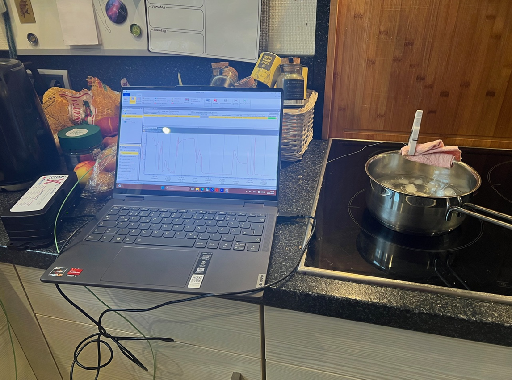

# Beispiel Eis kochen
In diesem Kapitel werden die praktischen Herausforderungen bei der Auswertung von Messdaten demonstriert.

``` {python}
#| echo: false

# Module laden
import numpy as np
import numpy.polynomial.polynomial as poly
import pandas as pd
import matplotlib.pyplot as plt
import scipy
```

## Versuchsaufbau
{fig-alt="Auf einem Küchenherd wird ein Topf mit Eiswasser zum Kochen gebracht. Mit einer Wäscheklammer sind zwei Thermoelemente eines Widerstandsthermometers fixiert. Ein angeschlossener Laptop zeichnet die Daten auf."}

In einem thermodynamischen Feldlabor wurde ein induktives Heizelement benutzt, um Eiswasser in einem metallischen Flüssigkeitsbehälter mit hoher Wärmeleitfähigkeit zum Sieden zu bringen. Mit einer nichtleitenden Halterung wurden zwei Thermoelemente eines Widerstandsthermometers fixiert. Ein TCTempX16 zeichnete die Daten auf, die mit einem Gerät zur automatisierten Datenverarbeitung ausgelesen wurden.

## Datei einlesen
Die Messreihe ist in der Datei '01-daten/Eis_Messung_1.xlsx' im Tabellenblatt 'T15949 MultiChannel - Daten' gespeichert.
```{python}
eis = pd.read_excel(io = '01-daten/Eis_Messung_1.xlsx', sheet_name = 'T15949 MultiChannel - Daten')

print(eis.head(n = 10))
```

Das Einlesen und Bereinigen der Daten finden Sie in dem folgenden Beispiel.

::: {#nte-eis .callout-note collapse="true"}
## Datensatz einlesen & bereinigen

Im Kopf des Tabellenblatts stehen Metadaten der Messung. Es gibt vier Spalten mit Daten: Datum und Zeit sowie die Messreihen der beiden Thermoelemente.
```{python}
eis = pd.read_excel(io = '01-daten/Eis_Messung_1.xlsx', sheet_name = 'T15949 MultiChannel - Daten', skiprows = 6)
print(eis.info())
```

Die Daten wurden korrekt eingelesen. Mit der Methode `pd.describe()` wird der Wertebereich der Spalten überprüft, um numerisch kodierte fehlende oder fehlerhafte Werte zu identifizieren.
```{python}
print(eis.describe())
```

Die Spalten Datum und Zeit enthalten die selben Informationen. Eine der beiden Spalten kann deshalb entfernt werden. Die Temperaturmessungen sollten näher betrachtet werden. Eishaltiges Wasser, das zum Kochen gebracht wird, sollte sich in einem Temperaturbereich von 0 bis 100 °C bewegen.
```{python}
eis.drop(labels = 'Datum', axis = 1, inplace = True)
```

Wir stellen den Datensatz grafisch dar.
```{python}
#| fig-alt: "Darstellung der gemessenen Temperaturen beider Thermoelemente über die Zeit."

eis.plot(x = 'Zeit', y = ['Thermoelement 1 (°C)', 'Thermoelement 2 (°C)'])
```

&nbsp;

Etwa in der Mitte des Datensatzes verzeichnen beide Sensoren extreme Fehlwerte. Diese sollen entfernt werden.

**Fehlwerte entfernen**

Zunächst betrachten wir den Bereich genauer.

```{python}
#| fig-alt: "Darstellung der gemessenen Temperaturen beider Thermoelemente über die Zeit im Bereich von ca. 55 bis 65 Grad Celsius."

n_zeilen = eis.shape[0]
eis.iloc[int(n_zeilen * 0.45): int(n_zeilen * 0.65)].plot(x = 'Zeit', y = ['Thermoelement 1 (°C)', 'Thermoelement 2 (°C)'])
```

&nbsp;

In einem bestimmten Abschnitt scheinen keine gültigen Werte vorzuliegen und diese sollen als ungültig markiert werden. Dazu betrachten wir zunächst die typische Veränderung der Messwerte, also die Differenz jedes Werts zu seinem Vorgänger mit der Methode `pd.Series.diff()`. Ebenfalls wird die Veränderung in studentisierten z-Werten ausgedrückt.

Die z-Werte werden mit der scipy-Funktion `scipy.stats.zscore(a, ddof = 1, nan_policy = 'omit'))` ermittelt. `a` steht für array-artige Daten, `ddof = 1` spezifiziert die Stichprobenstandardabweichung und das Argument `nan_policy = 'omit'` wird verwendet, um mit dem Wert `np.nan` an der ersten Stelle arbeiten zu können, der aus der Berechnung der Veränderung entsteht, da für den ersten Wert einer Reihe kein gültiger Wert berechnet werden kann.

:::: {#wrn-diffinnpandpd .callout-warning appearance="simple" collapse="true"}
## np.diff() und pd.diff()
NumPy und Pandas verfügen über eine Funktion diff. Diese verhalten sich standardmäßig unterschiedlich. Um die Länge einer Datenreihe mit `np.diff()` zu erhalten, können die Parameter `prepend` oder `append` verwendet werden, um der Datenreihe vor Ausführung der Operation einen Wert voranzustellen oder einen Wert anzuhängen. So bleiben die Länge der Datenreihe und die Indexpositionen der Werte erhalten.

```{python}
array = np.array([1, 3, 5, 6])
print(np.diff(array))
series = pd.Series(array)
print(series.diff())
print("\n", np.diff(array, prepend = np.nan))
```

::::

```{python}
#| fig-alt: "Darstellung der Temperaturdifferenz in Grad (links) und der absoluten z-Werte (rechts) für beide Thermoelemente über den Index der gemessenen Werte."

# absolute Differenzen ermitteln
diff_thermoelement1 = eis['Thermoelement 1 (°C)'].diff()
diff_thermoelement2 = eis['Thermoelement 2 (°C)'].diff()

# absolute z-scores ermitteln
abs_z_score_thermoelement1 = np.abs(scipy.stats.zscore(diff_thermoelement1, ddof = 1, nan_policy = 'omit'))
abs_z_score_thermoelement2 = np.abs(scipy.stats.zscore(diff_thermoelement2, ddof = 1, nan_policy = 'omit'))

# plotten
fig = plt.figure(figsize = (7.5, 7.5)) # sharex = True

ax = fig.add_subplot(2, 2, 1)
ax.plot(diff_thermoelement1, color = 'C0', label = 'Thermoelement 1')
ax.set_xlabel(xlabel = 'Index')
ax.set_ylabel(ylabel = 'Temperaturdifferenz in °C')
ax.grid()

ax = fig.add_subplot(2, 2, 2)
ax.plot(abs_z_score_thermoelement1, color = 'C0')
ax.set_xlabel(xlabel = 'Index')
ax.set_ylabel(ylabel = 'absolute z-Werte')
ax.grid()

ax = fig.add_subplot(2, 2, 3)
ax.plot(diff_thermoelement2, color = 'C1', label = 'Thermoelement 2')
ax.set_xlabel(xlabel = 'Index')
ax.set_ylabel(ylabel = 'Temperaturdifferenz in °C')
ax.grid()

ax = fig.add_subplot(2, 2, 4)
ax.plot(abs_z_score_thermoelement2, color = 'C1')
ax.set_xlabel(xlabel = 'Index')
ax.set_ylabel(ylabel = 'absolute z-Werte')
ax.grid()

fig.legend(loc = 'outside upper center', ncols = 2,  bbox_to_anchor = (0.5, 1.05)) 

plt.tight_layout()
plt.show()
```

&nbsp;

Die Position der ungültigen Werte kann sowohl über eine sinnvolle Schwelle der (absoluten) Temperaturveränderung oder der absoluten z-Werte bestimmt werden. In diesem Fall verwenden wir die absolute Temperaturveränderung und wählen den Schwellwert 10. Es wird die Position des ersten und des letzten Werts, der oberhalb dieses Schwellwerts liegt, bestimmt.

```{python}
# absolute Änderung bestimmen
diff_thermoelement1 = eis['Thermoelement 1 (°C)'].diff().abs()
diff_thermoelement2 = eis['Thermoelement 2 (°C)'].diff().abs()

# Schwellwert festlegen und prüfen
schwellwert = 10
bool_series_thermoelement1 = diff_thermoelement1 > schwellwert
bool_series_thermoelement2 = diff_thermoelement2 > schwellwert

# ersten und letzten Wert größer Schwellwert finden
## Thermoelement 1
### Wo steht nicht False?
### np.nonzero() gibt ein Tupel zurück
### Dieses enthält für jede Dimension ein array der Indexwerte
positionen_thermoelement1 = np.nonzero(bool_series_thermoelement1)

## Thermoelement 2
### Wo steht nicht False?
### np.nonzero() gibt ein Tupel zurück
### Dieses enthält für jede Dimension ein array der Indexwerte
positionen_thermoelement2 = np.nonzero(bool_series_thermoelement2)

# Ausgabe
## Thermoelement 1
print("Thermoelement 1")
print(51 * "=")
print("Anzahl der Temperaturänderungen mit Betrag > 10:", bool_series_thermoelement1.sum())
print(f"Die Position des ersten Werts: {positionen_thermoelement1[0][0]}")
print(f"Die Position des letzten Werts: {positionen_thermoelement1[0][-1]}")

## Thermoelement 2
print("\nThermoelement 2")
print(51 * "=")
print("Anzahl der Temperaturänderungen mit Betrag > 10:", bool_series_thermoelement2.sum())
print(f"Die Position des ersten Werts: {positionen_thermoelement2[0][0]}")
print(f"Die Position des letzten Werts: {positionen_thermoelement2[0][-1]}")
```

Für beide Thermoelemente kann der gleiche Bereich als ungültig markiert werden. Vor der weiteren Bearbeitung wird eine Kopie des aufgeräumten Datensatzes erstellt.
```{python}
von = positionen_thermoelement1[0][0]
bis = positionen_thermoelement1[0][-1]
eis.loc[von : bis, ['Thermoelement 1 (°C)', 'Thermoelement 2 (°C)']] = np.nan

# Kopie von eis anlegen
eis_backup = eis.copy()
```

:::

## Daten darstellen
Der Datensatz wird dargestellt. (In der Darstellung mit `pd.plot()` ist die automatisch gewählte x-Achsenbeschriftung unansehnlich. Deshalb wird ein Datenobjekt für die Darstellung angelegt und die Spalte 'Zeit' auf die Uhrzeit reduziert.)

```{python}
#| fig-alt: "Darstellung der gemessenen Temperaturen beider Thermoelemente über die Zeit. Die fehlerhaften Messwerte wurden entfernt."

# Darstellung mit automatischer Achsenbeschriftung
# eis.plot(x = 'Zeit', y = ['Thermoelement 1 (°C)', 'Thermoelement 2 (°C)'], grid = True)

plotting_data = eis.copy()
plotting_data['Zeit'] = plotting_data['Zeit'].dt.time

plotting_data.plot(x = 'Zeit', y = ['Thermoelement 1 (°C)', 'Thermoelement 2 (°C)'], grid = True)

plt.show()
```

## Referenzpunkte bestimmen
Für die Korrektur des Nullpunkt- und des Empfindlichkeitsfehlers sind als Referenzpunkte die Temperaturen 0 und 100 Grad Celsius bekannt: Solange Eis im Wasser schwimmt, hat es 0 °C, und bei 100 °C erreicht das Wasser seinen Siedepunkt.

::: {#wrn-100C .callout-warning appearance="simple"}
## Siedetemperatur von Wasser

Die Siedetemperatur von Wasser ist abhängig vom Luftdruck und beträgt 100 °C bei 1013,25 hPa. In Deutschland liegt die tatsächliche Siedetemperatur typischerweise etwas niedriger.
:::

### 0 °C
Für die wahre Temperatur 0 °C sind viele Messpunkte verfügbar. Schauen wir uns die ersten 100 Messwerte an:

```{python}
#| fig-alt: "Darstellung der gemessenen Temperaturen beider Thermoelemente über die ersten 101 Messwerte."

eis.loc[0 : 100, ['Thermoelement 1 (°C)', 'Thermoelement 2 (°C)']].plot(xlabel = 'Index', ylabel = 'gemessene Temperatur in °C')
```

&nbsp;

Der Zeitpunkt, ab dem die Wärmezufuhr beginnt, kann z. B. mit der Methode `pd.diff()` ermittelt werden:

```{python}
#| fig-alt: "Darstellung der Temperaturdifferenz für beide Thermoelemente über die ersten 101 Messwerte."

eis.loc[0 : 100, ['Thermoelement 1 (°C)', 'Thermoelement 2 (°C)']].diff().plot(xlabel = 'Index', ylabel = 'Temperaturdifferenz in °C')
```

&nbsp;

Da das Thermoelement 1 leichte Messabweichungen aufweist, wird ein Schwellwert etwas größer als 0 gewählt. Damit wird die Position des ersten Werts bestimmt, der oberhalb des Schwellwerts liegt.

```{python}
# absolute Änderung bestimmen
diff_thermoelement1 = eis.loc[0 : 100, 'Thermoelement 1 (°C)'].diff().abs()
diff_thermoelement2 = eis.loc[0 : 100, 'Thermoelement 2 (°C)'].diff().abs()

# Schwellwert festlegen und prüfen
schwellwert = 0.2
bool_series_thermoelement1 = diff_thermoelement1 > schwellwert
bool_series_thermoelement2 = diff_thermoelement2 > schwellwert

# ersten Wert größer Schwellwert finden
## Thermoelement 1
### Wo steht nicht False?
### np.nonzero() gibt ein Tupel zurück
### Dieses enthält für jede Dimension ein array der Indexwerte
positionen_thermoelement1 = np.nonzero(bool_series_thermoelement1)

## Thermoelement 2
### Wo steht nicht False?
### np.nonzero() gibt ein Tupel zurück
### Dieses enthält für jede Dimension ein array der Indexwerte
positionen_thermoelement2 = np.nonzero(bool_series_thermoelement2)

# Ausgabe
## Thermoelement 1
print("Thermoelement 1")
print(f"Die Position des ersten Werts: {positionen_thermoelement1[0][0]}")

## Thermoelement 2
print("\nThermoelement 2")
print(f"Die Position des ersten Werts: {positionen_thermoelement2[0][0]}")
```

Die Wärmezufuhr beginnt also bei dem Wert an Indexposition 67. Der Nullpunkt der Messreihe liegt somit an der Indexposition 67 - 1.

```{python}
start_wärmezufuhr = 67
start = start_wärmezufuhr - 1
```

## Nullpunktfehler korrigieren
Somit kann der Nullpunktfehler nun für beide Thermoelemente aus der Differenz zwischen dem Mittelwert der gemessenen Werte bis *exklusiv* Indexposition 67 und dem wahren Wert 0 direkt berechnet werden. Diese Position haben wir in der Variable start gespeichert, die für beide Thermoelemente gilt.

::: {#wrn-slicingmitloc .callout-warning appearance="simple"}
## Slicing mit pd.loc[]

Das Slicing mit `pd.loc[]` ist inklusiv.

:::

```{python}
nullpunktfehler_thermoelement1 = eis.loc[0 : start, 'Thermoelement 1 (°C)'].mean() - 0
nullpunktfehler_thermoelement2 = eis.loc[0 : start, 'Thermoelement 2 (°C)'].mean() - 0

print(f"Der Nullpunktfehler von Thermoelement 1 beträgt: {nullpunktfehler_thermoelement1}")
print(f"Der Nullpunktfehler von Thermoelement 2 beträgt: {nullpunktfehler_thermoelement2:.2f}")
```

Damit kann der Nullpunktfehler für beide Messreihen korrigiert werden.
```{python}
eis['Thermoelement 1 (°C)'] -= nullpunktfehler_thermoelement1
eis['Thermoelement 2 (°C)'] -= nullpunktfehler_thermoelement2
```

### 100 °C
Auch für die wahre Temperatur 100 Grad sind viele Messpunkte verfügbar. Wir wollen die letzten 120 Messwerte betrachten. Der Punkt, an dem das Wasser siedet, ist jedoch nicht so einfach zu bestimmen. Starke Messabweichungen erzeugen ein verrauschtes Bild. Um die grafische Analyse zu erleichtern wurden für beide Messreihen der gleitende Durchschnitt sowie der Mittelwert der geglätten Messreihen eingezeichnet. Diese Methoden werden Methoden im [Methodenbaustein Datenfitting und Datenoptimierung](https://bausteine-der-datenanalyse.github.io/m-datenfitting-und-optimierung/output/book/) vermittelt.

```{python}
#| fig-alt: "Darstellung der letzten 100 Messwerte für Thermoelement 1 und Thermoelement 2. Für beide Messreihen ist ein mit dem gleitenden Mittelwert geglättete Kurve eingezeichnet. Zusätzlich ist der Mittelwert der geglätteten Reihen eingezeichnet. Horizontal ist die Temperatur 100 °C durch eine gestrichelte Linie gekennzeichnet."

anzahl = 120

eis.loc[eis.shape[0] - anzahl : , ['Thermoelement 1 (°C)', 'Thermoelement 2 (°C)']].plot(alpha = 0.3, xlabel = 'Index', ylabel = 'gemessene Temperatur in °C')
plt.hlines(y = 100, xmin = eis.shape[0] - anzahl, xmax = eis.shape[0], linestyles = 'dashed', label = '100 °C')

# Daten glätten
window = 9
weights = np.ones(window) / window
thermoelement1_glatt = np.convolve(eis['Thermoelement 1 (°C)'], weights, mode = 'valid')
thermoelement2_glatt = np.convolve(eis['Thermoelement 2 (°C)'], weights, mode = 'valid')

plt.plot(eis.index[eis.shape[0] - anzahl + (window-1)//2 : -(window//2)], thermoelement1_glatt[eis.shape[0] - anzahl : ], label = 'Thermoel. 1 geglättet', color = 'C0')
plt.plot(eis.index[eis.shape[0] - anzahl + (window-1)//2 : -(window//2)], thermoelement2_glatt[eis.shape[0] - anzahl : ], label = 'Thermoel. 2 geglättet', color = 'C1')

mittelwert_der_sensoren = (thermoelement1_glatt[eis.shape[0] - anzahl : ] + thermoelement2_glatt[eis.shape[0] - anzahl : ]) / 2
plt.plot(eis.index[eis.shape[0] - anzahl + (window-1)//2 : -(window//2)], mittelwert_der_sensoren, label = 'geglätteter Mittelwert', linestyle = 'dashed', color = 'red')

plt.legend()
plt.show()
```

&nbsp;

Behelfsweise bestimmen wir den Referenzpunkt für 100 °C, indem die Werte zwischen dem Indexwert 500 und bis zu den letzten 10 Werten des Datensatzes gemittelt werden. Anschließend wird der Index bestimmt, an dem die Messwerte diesen Mittelwert erstmalig erreichen. (*Hinweis: Die Daten wurden bereits um den ermittelten Nullpunktfehler korrigiert.*)
```{python}
thermoelement1_max = eis['Thermoelement 1 (°C)'].iloc[500 : -10].mean()
thermoelement2_max = eis['Thermoelement 2 (°C)'].iloc[500 : -10].mean()

# ge = greater or equal, idxmax = find first occurrence of maximum value (0 and 1)
ende_thermoelement1 = eis['Thermoelement 1 (°C)'].ge(thermoelement1_max).idxmax()
ende_thermoelement2 = eis['Thermoelement 2 (°C)'].ge(thermoelement2_max).idxmax()

print(f"Gemitteltes Maximum Thermoelement 1: {thermoelement1_max:.2f} °C",
      f"Erstmalig erreicht an Position: {ende_thermoelement1 }", sep = "\n")
print(f"Gemitteltes Maximum Thermoelement 2: {thermoelement2_max:.2f} °C",
      f"Erstmalig erreicht an Position: {ende_thermoelement2 }", sep = "\n")
```

## Empfindlichkeitsfehler korrigieren
Mit den bekannten Start- und Endwerten kann der Empfindlichkeitsfehler geschätzt werden. Als Referenzpunkte sind bekannt:

  - Die Indexposition, an der die Wärmezufuhr beginnt und die in der Variable 'start_wärmezufuhr' gespeichert ist. An der Indexposition start_wärmezufuhr - 1 beträgt die wahre Temperatur 0 °C. Der Index dieses Werts ist in der Variable 'start' gespeichert (und ist für beide Thermoelemente identisch).
  - Die Indexposition, an der die Temperatur ihr Maximum erreicht. Solange Wasser im Topf ist, beträgt die wahre Temperatur 100 °C. Die Position dieses Werts konnte nur geschätzt werden und ist in den Variablen 'ende_thermoelement1' und 'ende_thermoelement1' gespeichert.

Thermoelement 1
``` {python}
ende =  ende_thermoelement1

# Empfindlichkeitsfehler bestimmen
lm_referenzpunkte = poly.polyfit(x = [0, 100], y = [eis.loc[start, 'Thermoelement 1 (°C)'], eis.loc[ende, 'Thermoelement 1 (°C)']], deg = 1)
spannfehler_thermoelement1 = lm_referenzpunkte[1]

print(f"Der Empfindlichkeitsfehler beträgt: {round((spannfehler_thermoelement1 - 1) * 100, 2)} %")
```

Thermoelement 2
``` {python}
ende =  ende_thermoelement2

# Empfindlichkeitsfehler bestimmen
lm_referenzpunkte = poly.polyfit(x = [0, 100], y = [eis.loc[start, 'Thermoelement 2 (°C)'], eis.loc[ende, 'Thermoelement 2 (°C)']], deg = 1)
spannfehler_thermoelement2 = lm_referenzpunkte[1]

print(f"Der Empfindlichkeitsfehler beträgt: {round((spannfehler_thermoelement2 - 1) * 100, 2)} %")
```

Somit kann der Empfindlichkeitsfehler korrigiert werden.
```{python}
# Empfindlichkeitsfehler Thermoelement 1 korrigieren
eis['Thermoelement 1 (°C)'] = eis['Thermoelement 1 (°C)'].div(spannfehler_thermoelement1)
eis['Thermoelement 2 (°C)'] = eis['Thermoelement 2 (°C)'].div(spannfehler_thermoelement2)

print(f"Maximum kalibriertes Thermoelement 1: {eis['Thermoelement 1 (°C)'].max():.2f}",
      f"Maximum kalibriertes Thermoelement 2: {eis['Thermoelement 2 (°C)'].max():.2f}",
      sep = '\n')
```

Schauen wir uns die kalibrierten Daten erneut an:
```{python}
#| fig-alt: "Darstellung der kalibrierten Temperaturen beider Thermoelemente über die Zeit. Die fehlerhaften Messwerte wurden entfernt."

plotting_data = eis.copy()
plotting_data['Zeit'] = plotting_data['Zeit'].dt.time

plotting_data.plot(x = 'Zeit', y = ['Thermoelement 1 (°C)', 'Thermoelement 2 (°C)'], grid = True)
plt.xlabel(xlabel = 'Index')
plt.ylabel(ylabel = '° C')

plt.show()
```

## Linearitätsfehler ermitteln
Die Daten wurden mit einem linearen Verfahren kalibriert, obwohl die Messwerte nichtlinear sind. Der Linearitätsfehler soll quantifiziert werden.

#### Festpunktmethode
Thermoelement 1
```{python}
#| fig-alt: "Darstellung der kalibrierten Temperatur von Thermoeelement 1 und der linearen Schätzung nach der Festpunktmethode über die Zeit."

ende = ende_thermoelement1

# Endpunktverbindende Gerade schätzen
# x muss bei Null beginnen
lm = poly.polyfit(
  x = [start - start, ende - start],
  y = [eis.loc[start, 'Thermoelement 1 (°C)'], eis.loc[ende, 'Thermoelement 1 (°C)']],
  deg = 1)
## print(lm.round(2)) # intercept + slope

# Vorhersagewerte schätzen
## np.arange() ist exklusiv
vorhersagewerte = poly.polyval(x = np.arange(start - start, ende - start + 1), c = lm)
### print(len(vorhersagewerte))
### print(len(np.arange(eis.loc[start:ende, :].shape[0])))

# Linearitätsfehler berechnen
linearitätsfehler_festpunkt = eis.loc[start:ende, 'Thermoelement 1 (°C)'].sub(vorhersagewerte).abs().max()
print(f"Linearitätsfehler nach Festpunktmethode: {linearitätsfehler_festpunkt:.2f} °C.")

# grafische Darstellung
plt.plot(np.arange(eis.shape[0]),
         eis['Thermoelement 1 (°C)'],
         label = 'Thermoelement 1')
plt.plot(np.arange(start, ende + 1),
         vorhersagewerte,
         label = 'Festpunktmethode')

# Position und Beschriftung der x-Achse setzen
plt.xticks(ticks = np.arange(0, eis.shape[0], 100), labels = eis['Zeit'].dt.time[::100]) 

plt.xlabel(xlabel = 'Zeit')
plt.ylabel(ylabel = '° C')
plt.grid()
plt.legend()


plt.show()
```

&nbsp;

Thermoelement 2
```{python}
#| fig-alt: "Darstellung der kalibrierten Temperatur von Thermoeelement 2 und der linearen Schätzung nach der Festpunktmethode über die Zeit."

ende = ende_thermoelement2

# Endpunktverbindende Gerade schätzen
# x muss bei Null beginnen
lm = poly.polyfit(
  x = [start - start, ende - start],
  y = [eis.loc[start, 'Thermoelement 2 (°C)'], eis.loc[ende, 'Thermoelement 2 (°C)']],
  deg = 1)
## print(lm.round(2)) # intercept + slope

# Vorhersagewerte schätzen
## np.arange() ist exklusiv
vorhersagewerte = poly.polyval(x = np.arange(start - start, ende - start + 1), c = lm)
### print(len(vorhersagewerte))
### print(len(np.arange(eis.loc[start:ende, :].shape[0])))

# Linearitätsfehler berechnen
linearitätsfehler_festpunkt = eis.loc[start:ende, 'Thermoelement 2 (°C)'].sub(vorhersagewerte).abs().max()
print(f"Linearitätsfehler nach Festpunktmethode: {linearitätsfehler_festpunkt:.2f} °C.")

# grafische Darstellung
plt.plot(np.arange(eis.shape[0]),
         eis['Thermoelement 2 (°C)'],
         label = 'Thermoelement 2')
plt.plot(np.arange(start, ende + 1),
         vorhersagewerte,
         label = 'Festpunktmethode')

# Position und Beschriftung der x-Achse setzen
plt.xticks(ticks = np.arange(0, eis.shape[0], 100), labels = eis['Zeit'].dt.time[::100]) 

plt.xlabel(xlabel = 'Zeit')
plt.ylabel(ylabel = '° C')
plt.grid()
plt.legend()

plt.show()
```

&nbsp;

#### Toleranzbandmethode
Für die Anwendung der Toleranzbandmethode wird die [Funktion linregress](https://docs.scipy.org/doc/scipy/reference/generated/scipy.stats.linregress.html#scipy.stats.linregress) aus dem Paket SciPy verwendet, da diese mit fehlenden Werten umgehen kann.

`linregress(x, y, alternative='two-sided', *, axis=0, nan_policy='propagate')`

Dafür wird der Parameter `nan_policy = 'omit'` gesetzt, wodurch Fehlwerte verworfen werden. Die Funktion gibt ein LinregressResult-Objekt zurück, dass den Zugriff auf die Regressionsobjekte über Attribute erlaubt. Für uns relevant sind die Attribute `LinregressResult.intercept` und `LinregressResult.slope`.

Thermoelement 1
```{python}
#| fig-alt: "Darstellung der kalibrierten Temperatur von Thermoeelement 1 und der linearen Schätzung nach der Toleranzbandmethode über die Zeit."

ende = ende_thermoelement1

# Regression durch die Messwerte
# x muss bei Null beginnen
lm = scipy.stats.linregress(
  x = np.arange(start - start, ende - start + 1),
  y = eis.loc[start:ende, 'Thermoelement 1 (°C)'],
  nan_policy = 'omit')
# print(lm.intercept, lm.slope)

# Vorhersagewerte schätzen
## np.arange() ist exklusiv
vorhersagewerte = poly.polyval(x = np.arange(start - start, ende - start + 1), c = [lm.intercept, lm.slope])

# Linearitätsfehler berechnen
linearitätsfehler_toleranzband = eis.loc[start:ende, 'Thermoelement 1 (°C)'].sub(vorhersagewerte).abs().max()
print(f"Linearitätsfehler nach Toleranzbandmethode: {linearitätsfehler_toleranzband:.2f} °C.")

# grafische Darstellung
plt.plot(np.arange(eis.shape[0]),
         eis['Thermoelement 1 (°C)'],
         label = 'Thermoelement 1')
plt.plot(np.arange(start, ende + 1),
         vorhersagewerte,
         label = 'Toleranzbandmethode')

# Position und Beschriftung der x-Achse setzen
plt.xticks(ticks = np.arange(0, eis.shape[0], 100), labels = eis['Zeit'].dt.time[::100]) 

plt.xlabel(xlabel = 'Zeit')
plt.ylabel(ylabel = '° C')
plt.grid()
plt.legend()

plt.show()
```

&nbsp;

Thermoelement 2:
```{python}
#| fig-alt: "Darstellung der kalibrierten Temperatur von Thermoeelement 2 und der linearen Schätzung nach der Toleranzbandmethode über die Zeit."

ende = ende_thermoelement2

# Regression durch die Messwerte
# x muss bei Null beginnen
lm = scipy.stats.linregress(
  x = np.arange(start - start, ende - start + 1),
  y = eis.loc[start:ende, 'Thermoelement 2 (°C)'],
  nan_policy = 'omit')
# print(lm.intercept, lm.slope)

# Vorhersagewerte schätzen
## np.arange() ist exklusiv
vorhersagewerte = poly.polyval(x = np.arange(start - start, ende - start + 1), c = [lm.intercept, lm.slope])

# Linearitätsfehler berechnen
linearitätsfehler_toleranzband = eis.loc[start:ende, 'Thermoelement 2 (°C)'].sub(vorhersagewerte).abs().max()
print(f"Linearitätsfehler nach Toleranzbandmethode: {linearitätsfehler_toleranzband:.2f} °C.")

# grafische Darstellung
plt.plot(np.arange(eis.shape[0]),
         eis['Thermoelement 2 (°C)'],
         label = 'Thermoelement 2')
plt.plot(np.arange(start, ende + 1),
         vorhersagewerte,
         label = 'Toleranzbandmethode')

# Position und Beschriftung der x-Achse setzen
plt.xticks(ticks = np.arange(0, eis.shape[0], 100), labels = eis['Zeit'].dt.time[::100]) 

plt.xlabel(xlabel = 'Zeit')
plt.ylabel(ylabel = '° C')
plt.grid()
plt.legend()

plt.show()

```


## Zweipunktkalibrierung
Für die Zweipunktkalibrierung stellen wir den in @nte-eis eingelesenen Datensatz wieder her.
```{python}
eis = eis_backup.copy()

wahres_minimum = 0
wahres_maximum = 100

# Thermoelement 1
ende = ende_thermoelement1

a = (wahres_maximum - wahres_minimum) / (eis.loc[start:ende, 'Thermoelement 1 (°C)'].max() - eis.loc[start:ende, 'Thermoelement 1 (°C)'].min())
b = wahres_minimum - a * eis.loc[start:ende, 'Thermoelement 1 (°C)'].min()

eis['Thermoelement 1 (°C)'] = a * eis['Thermoelement 1 (°C)'] + b

## Ausgabe
print(f"Thermoelement 1",
      f"a = {a:.1f}",
      f"b = {b:.1f}",
      f"Nullpunktfehler: {round(-1 * b / a, 2)}",
      f"Empfindlichkeitsfehler: {round( ((1 / a) - 1) * 100, 2)} %",
      sep = '\n')
print()

# Thermoelement 2
ende = ende_thermoelement2

a = (wahres_maximum - wahres_minimum) / (eis.loc[start:ende, 'Thermoelement 2 (°C)'].max() - eis.loc[start:ende, 'Thermoelement 2 (°C)'].min())
b = wahres_minimum - a * eis.loc[start:ende, 'Thermoelement 2 (°C)'].min()

eis['Thermoelement 2 (°C)'] = a * eis['Thermoelement 2 (°C)'] + b

## Ausgabe
print(f"Thermoelement 2",
      f"a = {a:.1f}",
      f"b = {b:.1f}",
      f"Nullpunktfehler: {round(-1 * b / a, 2)}",
      f"Empfindlichkeitsfehler: {round( ((1 / a) - 1) * 100, 2)} %",
      sep = '\n')

# plotten
plotting_data = eis.copy()
plotting_data['Zeit'] = plotting_data['Zeit'].dt.time

plotting_data.plot(x = 'Zeit', y = ['Thermoelement 1 (°C)', 'Thermoelement 2 (°C)'], grid = True)

plt.show()
```

```{python}
print(f"Maximum kalibriertes Thermoelement 1: {eis['Thermoelement 1 (°C)'].max():.2f}",
      f"Maximum kalibriertes Thermoelement 2: {eis['Thermoelement 2 (°C)'].max():.2f}",
      sep = '\n')
```

